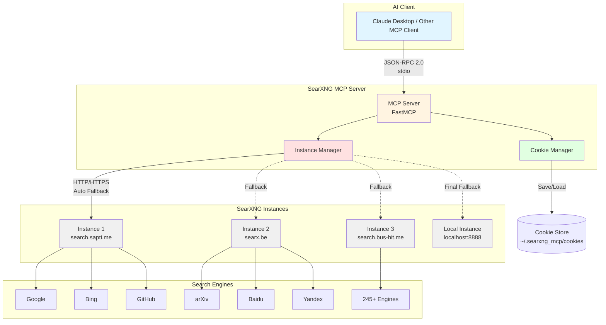

# SearXNG MCP Server

A [Model Context Protocol (MCP)](https://modelcontextprotocol.io) 2.0 server that provides AI agents with powerful search capabilities through [SearXNG](https://docs.searxng.org), a privacy-respecting metasearch engine aggregating results from 245+ search engines.

[](https://opensource.org/licenses/MIT)
[](https://www.python.org/downloads/)
[](https://github.com/psf/black)
[](https://github.com/astral-sh/ruff)
[](https://modelcontextprotocol.io)
[](https://github.com/jlowin/fastmcp)

> **Quick Start:** `python wizard.py` (interactive wizard) or `./install.sh` (Unix) / `install.bat` (Windows)  
> **Dashboard:** `python -m searxng_mcp.dashboard` (http://localhost:8765)  
> **Agent Guide:** [MCP_AGENT_GUIDE.md](MCP_AGENT_GUIDE.md) | **Full Guide:** [INSTALL.md](INSTALL.md) | **Dashboard:** [DASHBOARD.md](DASHBOARD.md)

## Features

### Core Search
- 🌐 **Multi-Instance Resilience**: Automatic fallover across public SearXNG instances with optional local instance support
- 🌍 **Global Reach**: Support for 245+ engines including regional and non-English engines (Baidu, Yandex, Naver, etc.)
- 🎯 **Advanced Search**: Bang syntax (!go, !gh), language modifiers (:en, :zh), and 10 specialized categories
- 🍪 **Preference Persistence**: Cookie-based session management to maintain user preferences across searches
- 🔒 **Privacy-Focused**: No tracking, respects SearXNG's privacy principles and MCP security guidelines

### AI Enhancement (Optional)
- 🤖 **AI-Powered Summarization**: Get intelligent summaries of search results
- 💡 **Key Insights Extraction**: Automatic extraction of important findings
- 📚 **Source Recommendations**: AI-curated top sources with explanations
- 🔄 **Multi-Provider Support**: OpenRouter (Mistral Large 2512), Ollama Cloud (Mistral Large 3), Google Gemini
- 🎯 **Auto-Update**: Gemini Flash model auto-detects latest version

### Tools & Monitoring
- 🧙 **Interactive Setup Wizard**: Guided terminal wizard for easy configuration (`python wizard.py`)
- 🎨 **Professional Web Dashboard**: Real-time monitoring with dark theme (http://localhost:8765)
- 🏥 **Health Check Tool**: CLI tool for instance health checking and diagnostics
- 📊 **Real-Time Monitoring**: WebSocket-based live instance health tracking
- ⚡ **FastMCP Integration**: Built with FastMCP for automatic schema generation and transport flexibility

## Search Categories & Engines

SearXNG organizes 245+ search engines into 10 categories:

| Category | Description | Example Engines | Bang Examples |
|----------|-------------|-----------------|---------------|
| **general** | General web search | google, bing, duckduckgo, startpage, brave, yandex, baidu (ZH), naver (KO), quark (ZH), sogou (ZH) | `!go`, `!bi`, `!ddg`, `!yd`, `!bd` |
| **images** | Image search | google_images, bing_images, unsplash, pixabay, flickr | `!goi`, `!bii`, `!unsplash` |
| **videos** | Video search | youtube, vimeo, dailymotion, bilibili, niconico | `!yt`, `!vim`, `!bili` |
| **news** | News search | google_news, bing_news, reuters, bbc, tagesschau (DE), 360search (ZH) | `!gn`, `!bn`, `!bbc` |
| **map** | Maps & location | openstreetmap, apple_maps, photon | `!osm`, `!am` |
| **music** | Music search | genius, bandcamp, soundcloud, deezer, radio_browser | `!gen`, `!sc`, `!bc` |
| **it** | IT & software | github, stackoverflow, pypi, docker_hub, huggingface, gitlab | `!gh`, `!so`, `!pypi`, `!hf` |
| **science** | Scientific papers | arxiv, pubmed, crossref, semantic_scholar, google_scholar | `!arx`, `!pub`, `!gs` |
| **files** | File search | apkmirror, fdroid, google_play, zlibrary, annas_archive | `!apk`, `!fdr`, `!zlib` |
| **social_media** | Social platforms | reddit, mastodon, lemmy, 9gag, tootfinder | `!red`, `!mast`, `!lem` |

## Architecture



**Flow:**
1. AI client sends search request via MCP protocol (stdio transport)
2. MCP server validates and routes to Instance Manager
3. Instance Manager tries configured instances with automatic fallback
4. Cookie Manager maintains preferences per instance
5. SearXNG instances aggregate results from 245+ search engines
6. Results returned to AI client in structured JSON format

## Installation

### Quick Install

**Windows:**
```cmd
git clone https://github.com/Grumpified-OGGVCT/SearXng_MCP.git
cd SearXng_MCP
install.bat
```

**Linux / macOS:**
```bash
git clone https://github.com/Grumpified-OGGVCT/SearXng_MCP.git
cd SearXng_MCP
./install.sh
```

### Prerequisites

- Python 3.10 or higher
- pip package manager
- Git (optional, for cloning)

### Automated Installation Scripts

We provide professional installation scripts for all platforms:

#### Windows
```cmd
# Basic installation
install.bat

# With development dependencies
install.bat --dev

# Upgrade existing installation
install.bat --upgrade

# Show help
install.bat --help
```

#### Linux / macOS
```bash
# Make scripts executable (first time only)
chmod +x install.sh run.sh

# Basic installation
./install.sh

# With development dependencies
./install.sh --dev

# Upgrade existing installation
./install.sh --upgrade

# Show help
./install.sh --help
```

The installation scripts will:
- ✅ Check Python version (3.10+)
- ✅ Create virtual environment
- ✅ Install all dependencies
- ✅ Set up the package
- ✅ Create configuration files
- ✅ Set up cookie directory

### Manual Installation

If you prefer manual installation, see [INSTALL.md](INSTALL.md) for detailed instructions.

### Platform-Specific Notes

#### macOS
```bash
# Install Python via Homebrew (recommended)
brew install python@3.11

# Then run installation script
./install.sh
```

#### Linux (Ubuntu/Debian)
```bash
# Install Python 3.11
sudo apt update
sudo apt install python3.11 python3.11-venv python3-pip

# Then run installation script
./install.sh
```

#### Windows
```powershell
# Install Python (check "Add to PATH")
winget install Python.Python.3.11

# Then run installation script
install.bat
```

📖 **For complete installation guide with troubleshooting, see [INSTALL.md](INSTALL.md)**

## Configuration

### Environment Variables

Configure SearXNG instances and behavior via environment variables:

```bash
# Custom SearXNG instances (comma-separated)
export SEARXNG_INSTANCES="https://search.example.com,https://searx.example.org"

# Local SearXNG instance for fallback (optional)
export SEARXNG_LOCAL_INSTANCE="http://localhost:8888"
```

### MCP Client Configuration

Add to your MCP client configuration (e.g., Claude Desktop):

#### Using stdio transport (recommended)

```json
{
  "mcpServers": {
    "searxng": {
      "command": "python",
      "args": ["-m", "searxng_mcp.server"],
      "env": {
        "SEARXNG_INSTANCES": "https://search.sapti.me,https://searx.be"
      }
    }
  }
}
```

#### Using SSE transport

```json
{
  "mcpServers": {
    "searxng": {
      "url": "http://localhost:8000/sse",
      "transport": "sse"
    }
  }
}
```

## Usage

### Running the Server

#### Using Run Scripts (Recommended)

**Windows:**
```cmd
run.bat
```

**Linux / macOS:**
```bash
./run.sh
```

The run scripts will:
- ✅ Verify installation
- ✅ Activate virtual environment
- ✅ Load configuration from .env
- ✅ Start the MCP server

#### Running Directly

**Stdio mode (for MCP clients):**
```bash
# Activate virtual environment first
source .venv/bin/activate  # Linux/macOS
.venv\Scripts\activate     # Windows

# Run server
python -m searxng_mcp.server
```

#### SSE mode (for HTTP clients)
```bash
# Coming soon - FastMCP supports multiple transports
```

### Configuration Files

#### .env File

Create or edit `.env` in the project root:
```bash
# Copy example
cp .env.example .env  # Linux/macOS
copy .env.example .env  # Windows

# Edit with your settings
nano .env  # Linux/macOS
notepad .env  # Windows
```

#### MCP Client Configuration

**Location:**
- Windows: `%APPDATA%\Claude\claude_desktop_config.json`
- macOS: `~/Library/Application Support/Claude/claude_desktop_config.json`
- Linux: `~/.config/claude/claude_desktop_config.json`

**Configuration with scripts:**
```json
{
  "mcpServers": {
    "searxng": {
      "command": "C:\\Path\\To\\SearXng_MCP\\run.bat",
      "args": []
    }
  }
}
```

**Configuration with Python directly:**
```json
{
  "mcpServers": {
    "searxng": {
      "command": "python",
      "args": ["-m", "searxng_mcp.server"],
      "env": {
        "SEARXNG_INSTANCES": "https://search.sapti.me,https://searx.be"
      }
    }
  }
}
```

### MCP Tools

The server exposes three MCP tools:

#### 1. `search` - Perform searches

```python
# Basic search
search(query="python asyncio")

# Category-specific search
search(query="machine learning", categories="science")

# Engine-specific search
search(query="pytorch tutorials", engines="github,stackoverflow")

# Language-specific search
search(query="人工智能", language="zh")

# Time-filtered search
search(query="AI news", categories="news", time_range="week")

# Using bang syntax
search(query="fastapi docs !gh")  # Search GitHub
search(query="quantum computing :de")  # Search in German

# AI-enhanced search (requires configuration)
search(query="quantum computing implications", ai_enhance=True)
```

**Parameters:**
- `query` (required): Search query with optional bang syntax
- `categories`: Comma-separated categories (general, images, videos, news, map, music, it, science, files, social_media)
- `engines`: Comma-separated engine names
- `language`: Language code (en, zh, de, fr, es, ja, ko, ru, ar, etc.)
- `time_range`: Filter by time (day, week, month, year)
- `safesearch`: Safe search level (0=off, 1=moderate, 2=strict)
- `page`: Results page number (default: 1)
- `ai_enhance`: Enable AI-powered summarization (default: False, requires AI provider configuration)

#### 2. `list_categories` - List available categories

```python
list_categories()
# Returns: Dictionary of categories and their popular engines
```

#### 3. `get_instances` - View configured instances

```python
get_instances()
# Returns: List of online instances, local instance, and timeout settings
```

## AI Enhancement (Optional)

Enable intelligent summarization and insights extraction using state-of-the-art language models.

### Supported Providers

#### 1. OpenRouter - Mistral Large 2512

**Setup:**
```bash
export SEARXNG_AI_PROVIDER=openrouter
export SEARXNG_AI_API_KEY=your_openrouter_api_key
# Model is auto-set to: mistralai/mistral-large-2512
```

Get API key: https://openrouter.ai/keys

#### 2. Ollama Cloud - Mistral Large 3

**Setup:**
```bash
export SEARXNG_AI_PROVIDER=ollama
export SEARXNG_AI_API_KEY=your_ollama_cloud_api_key
# Model is auto-set to: mistral-large-3:675b-cloud
```

Get API key: https://ollama.com/settings/keys  
**Note:** This is Ollama **CLOUD** service, not local Ollama

#### 3. Google Gemini - Latest Flash Model

**Setup:**
```bash
export SEARXNG_AI_PROVIDER=gemini
export SEARXNG_AI_API_KEY=your_gemini_api_key
# Model is auto-detected (e.g., gemini-2.0-flash-exp)
```

Get API key: https://aistudio.google.com/app/apikey

**Features:**
- 🔄 **Auto-update**: Automatically detects latest Gemini Flash model
- 🚀 **Latest Technology**: Always uses newest Flash version
- 🛡️ **Fallback**: Uses known stable version if detection fails

### Usage

Enable AI enhancement with `ai_enhance=True`:

```python
# Basic AI-enhanced search
result = search(query="quantum computing", ai_enhance=True)

# Returns enhanced results with:
# - ai_summary: Comprehensive 2-3 paragraph summary
# - key_insights: 3-5 important findings
# - recommended_sources: Top 3 sources with explanations
# - model: Model used (e.g., "mistralai/mistral-large-2512")
# - provider: Provider used (e.g., "openrouter")
```

### When to Use AI Enhancement

**✅ Good for:**
- Research questions needing synthesis
- Complex topics requiring summarization  
- Curated source recommendations
- Information gathering for decisions

**❌ Avoid for:**
- Simple factual lookups (adds latency)
- When raw results are sufficient
- Real-time/time-sensitive searches

## Additional Tools

### Interactive Setup Wizard

Run the guided setup wizard for easy configuration:

```bash
python wizard.py
```

Features:
- OS detection (Windows/Linux/macOS)
- Instance strategy selection (online-only, local, hybrid)
- AI provider configuration
- Local SearXNG installation guidance
- Automatic .env file generation

### Web Dashboard

Monitor your SearXNG MCP server in real-time:

```bash
python -m searxng_mcp.dashboard
```

Then open: http://localhost:8765

Features:
- 🎨 Professional dark theme
- 📊 Real-time instance health monitoring
- ⚡ Response time tracking
- 🔍 Built-in search testing
- 🔌 WebSocket-based live updates
- 📋 Configuration viewer

### Health Check Tool

Check the health of all configured instances:

```bash
# Basic health check
python -m searxng_mcp.health

# With configuration details
python -m searxng_mcp.health --verbose
```

Features:
- Tests all configured instances
- Shows response times
- Color-coded status (healthy/timeout/unreachable)
- Exit codes for automation (0=healthy, 1=some failing, 2=all failing)

### Search Syntax

SearXNG supports powerful search syntax:

- **Bang modifiers**: `!go` (Google), `!gh` (GitHub), `!yt` (YouTube), `!arx` (arXiv)
- **Language modifiers**: `:en`, `:zh`, `:de`, `:fr`, `:ja`, `:ko`
- **External bangs**: `!!w` (Wikipedia), `!!g` (Google)
- **Special queries**: `random uuid`, `md5 text`, `user-agent`

### Cookie Persistence

Cookies are automatically saved per instance in `~/.searxng_mcp/cookies/`. This preserves:
- Language preferences
- Disabled plugins
- Selected engines
- Theme settings

## Architecture

### Instance Management

The server implements a resilient multi-instance architecture:

1. **Primary Instances**: Tries configured public instances in order (default timeout: 5s)
2. **Local Fallback**: Falls back to local instance if configured (timeout: 15s)
3. **Cookie Persistence**: Maintains separate cookie jars per instance
4. **Automatic Retry**: Seamlessly fails over to next instance on error

### MCP 2.0 Compliance

- **JSON-RPC 2.0**: All communication follows MCP specification
- **Capability Negotiation**: Proper handshake and capability exchange
- **Security**: Respects user consent, data privacy, and tool safety principles
- **Transport Flexibility**: Supports stdio, SSE, and future transports

## Development

### Setup Development Environment

```bash
# Install development dependencies
pip install -r requirements-dev.txt

# Or with uv
uv pip install -r requirements-dev.txt
```

### Code Quality

```bash
# Format code
black src/

# Lint code
ruff check src/

# Type checking
mypy src/
```

### Testing

```bash
# Run tests (when test suite is added)
pytest tests/
```

## Deployment

### Docker (Coming Soon)

```dockerfile
# Dockerfile example
FROM python:3.11-slim
WORKDIR /app
COPY . .
RUN pip install -e .
CMD ["python", "-m", "searxng_mcp.server"]
```

### Systemd Service (Linux)

```ini
[Unit]
Description=SearXNG MCP Server
After=network.target

[Service]
Type=simple
User=youruser
WorkingDirectory=/path/to/SearXng_MCP
Environment="SEARXNG_INSTANCES=https://search.example.com"
ExecStart=/usr/bin/python3 -m searxng_mcp.server
Restart=on-failure

[Install]
WantedBy=multi-user.target
```

## Roadmap

- [ ] Dynamic instance discovery from searx.space
- [ ] Local caching layer for frequent queries
- [ ] Rate limiting and quota management
- [ ] MCP resources for preference management
- [ ] Authentication support for API-key–protected instances
- [ ] Health monitoring and metrics
- [ ] Docker container and Kubernetes deployment
- [ ] Comprehensive test suite
- [ ] CLI interface for standalone use

## Documentation

### For AI Agents

📋 **[MCP_AGENT_GUIDE.md](MCP_AGENT_GUIDE.md)** - **Single Source of Truth**  
Complete guide for AI agents using this tool:
- Quick reference and examples
- Complete tool catalog
- Search capabilities and syntax
- AI enhancement guide
- Usage patterns and best practices
- Configuration and troubleshooting

### For Users

📚 **[QUICKSTART.md](QUICKSTART.md)** - 5-minute setup guide  
🔧 **[INSTALL.md](INSTALL.md)** - Complete installation instructions  
🎨 **[DASHBOARD.md](DASHBOARD.md)** - Web dashboard guide  
🤝 **[CONTRIBUTING.md](CONTRIBUTING.md)** - Contribution guidelines  
🔒 **[SECURITY.md](SECURITY.md)** - Security policies

### Testing & Quality

✅ **[TEST_REPORT_100_PERCENT.md](TEST_REPORT_100_PERCENT.md)** - 100% test pass report  
🔍 **[COVE_ANALYSIS_V2.md](COVE_ANALYSIS_V2.md)** - Comprehensive QA analysis  
📊 **[STATUS_V0.2.0.md](STATUS_V0.2.0.md)** - Release status

## References

- [Model Context Protocol Specification](https://modelcontextprotocol.io/specification/2025-11-25)
- [FastMCP Framework](https://github.com/jlowin/fastmcp)
- [SearXNG Documentation](https://docs.searxng.org)
- [SearXNG Search API](https://docs.searxng.org/dev/search_api.html)
- [SearXNG Search Syntax](https://docs.searxng.org/user/search-syntax.html)
- [SearXNG Public Instances](https://searx.space)

## Contributing

Contributions are welcome! Please see [CONTRIBUTING.md](CONTRIBUTING.md) for guidelines.

## License

This project is licensed under the MIT License - see the [LICENSE](LICENSE) file for details.

## Acknowledgments

- **SearXNG Team**: For building an amazing privacy-respecting metasearch engine
- **FastMCP Authors**: For the excellent Python MCP framework
- **MCP Community**: For advancing the Model Context Protocol specification
